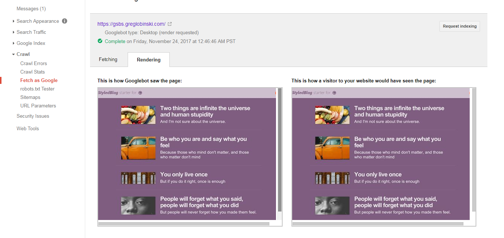

# StyledBlog starter for Gatsby

[DEMO website](https://gsbs.greglobinski.com/)


This is a starter/theme for [Gatsby](https://github.com/gatsbyjs/gatsby).

## Description

The goal is to make a theme for Gatsby which will look like an app.

### No webfonts

I did it first time for many years. I created a website front-end with using no
webfonts. The StyledBlog uses only system fonts. So the typography looks a litle
different on different devices. This is the whole font setting
`/src/styles/global.js`

```
body {
    font-family: "-apple-system", "BlinkMacSystemFont", "Segoe UI", "Roboto","Oxygen", "Ubuntu", "Cantarell", "Fira Sans", "Droid Sans", "Helvetica Neue", "sans-serif";
  }
```

That's all. And it looks great. The inspiration came from
[reactjs.org](https://reactjs.org/). But, if you need them, I mean webfonts,
it's easy to add, take a look at the Customization section below.

### styled-components

StyledBlog uses [styled-components](https://www.styled-components.com/) and
[gatsby-plugin-styled-components](https://www.gatsbyjs.org/packages/gatsby-plugin-styled-components/).
Three important files to notice: `/src/styles/global.js` with global styles,
`/src/styles/colors.js` with color palette variables and `/src/styles/theme.js`
with a styled-component theme.

## Setup

If you are completely new to Gatsby, start with one of its
[official blog starters](https://www.gatsbyjs.org/docs/gatsby-starters/). If you
have already went through with the
[tutorials](https://www.gatsbyjs.org/tutorial/) install the starter like any
other one using `gatsby new` command.

```
gatsby new [NEW_SITE_DIRECTORY_FOR_YOUR_BLOG] git@github.com:greglobinski/gatsby-styled-blog-starter.git
```

## Customization

### Website data

Edit `\src\utils\siteConfig.js`

```
module.exports = {
  pathPrefix: "/",
  siteTitle: "Gatsby StyledBlog starter",
  siteLongTitle: "Gatsby StyledBlog Theme/Starter",
  siteUrl: "https://gsbs.greglobinski.com",
  siteLanguage: "en",
  siteLogo: "/logos/logo-1024.png",
  siteDescription: "This is a starter/theme for GatsbyJS",
  // manifest.json
  manifestName: "StyledBlog Gatsby starter",
  manifestShortName: "StyledBlog",
  manifestStartUrl: "/",
  manifestBackgroundColor: colors.first,
  manifestThemeColor: colors.firstLight,
  manifestDisplay: "standalone",
  // Author note
  authorName: "Mr. Gatsby",
  authorDescription: `Proin ornare ligula eu tellus tempus elementum. Aenean bibendum iaculis mi, nec blandit lacus interdum vitae. Vestibulum non nibh risus, a scelerisque purus. `,
  // texts
  copyright:
    "This is the place for a copyrigh note - editable through config object"
};
```

### Color palette

Edit the `\src\styles\colors.js` file to customize the color palette.

```
module.exports = {
  first: "#7F5D80",
  firstLight: "#CFC0CF",
  firstSuperLight: "#F4F0F4",
  firstDark: "#563E57",
  accent: "#FF6633",
  bright: "#ffffff",
  light: "#f3f3f3",
  middle: "#666666",
  dark: "#333333",
  superDark: "#111111"
};
```

### Theme

Edit the `\src\styles\theme.js` file to customize colors of element.

```
const colors = require("./colors");

const theme = {
  navigator: {
    colors: {
      title: colors.firstSuperLight,
      subTitle: colors.bright,
      scrollTrack: colors.first,
      scrollThumb: colors.firstDark,
      linkHover: colors.bright,
      header: colors.firstSuperLight,
      asideItemActiveBorder: colors.accent
    },
    sizes: {
      asideWidth: "19em",
      maxWidth: "56em"
    },
    backgrounds: {
      wrapper: colors.first,
      asideItemActive: colors.firstDark
    }
  },
  post: {
    colors: {
      author: colors.middle,
      authorBorder: colors.firstLight,
      bold: colors.middle,
      blockquoteFrame: colors.light,
      copyright: colors.middle,
      link: colors.first,
      linkHover: colors.firstLight,
      meta: colors.middle,
      metaBorder: colors.first,
      text: colors.dark,
      title: colors.middle,
      subTitle: colors.superDark
    },
    backgrounds: {
      wrapper: colors.bright,
      meta: colors.light
    },
    sizes: {
      maxWidth: "50em"
    }
  },
  bottomBar: {
    colors: {
      link: colors.bright,
      icon: colors.firstSuperLight
    },
    backgrounds: {
      wrapper: colors.first,
      icon: colors.firstDark
    },
    sizes: {
      height: 44 //pixels
    }
  },
  topBar: {
    colors: {
      link: colors.bright,
      linkPost: colors.first
    },
    backgrounds: {
      wrapper: colors.firstLight,
      wrapperPost: colors.bright,
      icon: colors.accent
    },
    sizes: {
      height: 44 //pixels
    }
  },
  info: {
    colors: {
      text: colors.firstDark,
      link: colors.firstDark,
      linkHover: colors.first,
      btn: colors.bright
    },
    backgrounds: {
      wrapper: colors.firstLight,
      btn: colors.accent
    },
    sizes: {
      maxWidth: "40em"
    }
  },
  mediaQueryTresholds: {
    XL: "65em",
    L: "49em",
    M: "37em",
    S: "28em",
    XS: "21em"
  }
};
```

### Webfonts

As I mentioned above StyledBlog does not use webfonts. If you need them, the
simplest way is to use Google Fonts through
[Typography.js](https://kyleamathews.github.io/typography.js/). But instead
installing Typography.js directly use
[gatsby-plugin-typography](https://www.gatsbyjs.org/tutorial/part-two/#typographyjs).

Remember to update `body { font-family: ....}` in the `/src/styles/global.js`
file. Remove also `import "normalize.css";` from `/src/layouts/index.js`,
Typography comes with its own normalize styles.

### Posts

Content of the blog is located in the `/content/posts/` directory in markdown
files.

# Status

I like the approach described in the saying "Do it, then do it right and then do
it even better." So...

### What was done

I started with
[gatsby-starter-hello-world](https://github.com/gatsbyjs/gatsby-starter-hello-world).

Then installed some Gatsby plugins: gatsby-image, gatsby-plugin-catch-links,
gatsby-plugin-manifest, gatsby-plugin-netlify, gatsby-plugin-offline,
gatsby-plugin-react-helmet, gatsby-plugin-sharp,
gatsby-plugin-styled-components, gatsby-plugin-typography,
gatsby-remark-copy-linked-files, gatsby-remark-images, gatsby-remark-prismjs,
gatsby-remark-responsive-ifram, gatsby-remark-smartypants,
gatsby-source-filesystem, gatsby-transformer-remark, gatsby-transformer-sharp

And a couple of other packages: normalize.css, styled-components

Finaly created four React components: Navigator, TopBar, BottomBar and Info.
There are also other comonents, but they are only for code organizing.

### What need to be done to 'Do it right'

* Fix bugs
* Add redux (react-redux) to manage state of interface
* Types (prop-types/?/flow)
* Refactor animations for mobile
* Categories
* SEO component
* Disqus Comments
* ...

### What can be done to "make it even better"

* Searching
* PWA push notifications (?)
* Localstorage for user history
* ...

# Bugs

### No JavaScript empty home page

The _Navigator_ component is a child of main layout component. The main layout
component gets _posts_ data through callback function from
`/src/pages/index.js`. Because of that, when JavaScript in the user's web
browser is off and the user visits the home page it seas the TopBar only, there
is no list of posts. It will be fixed after I implement redux. It's not
connected, but redux implementation is on the go, there are already Containers
components.

The bug is real, but it's not as critical as I thought. Yeah, it hits no JS
users, but from the SEO point there is no problem. Googlebog see the home page
properly.



### Outline focus

I wanted to use [what-input](https://github.com/ten1seven/what-input) package to
suppress focus outline on buttons and links when users uses mouse. But for now
the package breaks `gatsby build` process. So, first I will send a fix pull
request to the package repo.

# Updates

If you are interested in updates follow me at
[@greglobinski](https://twitter.com/greglobinski).
